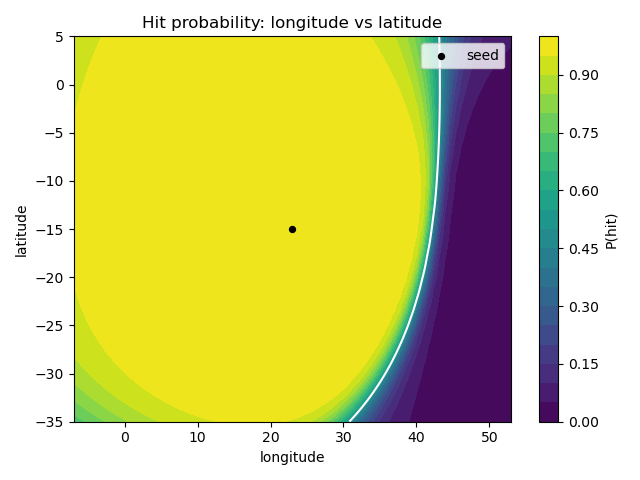
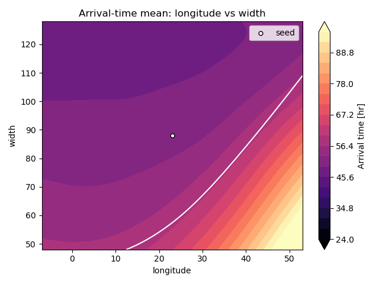
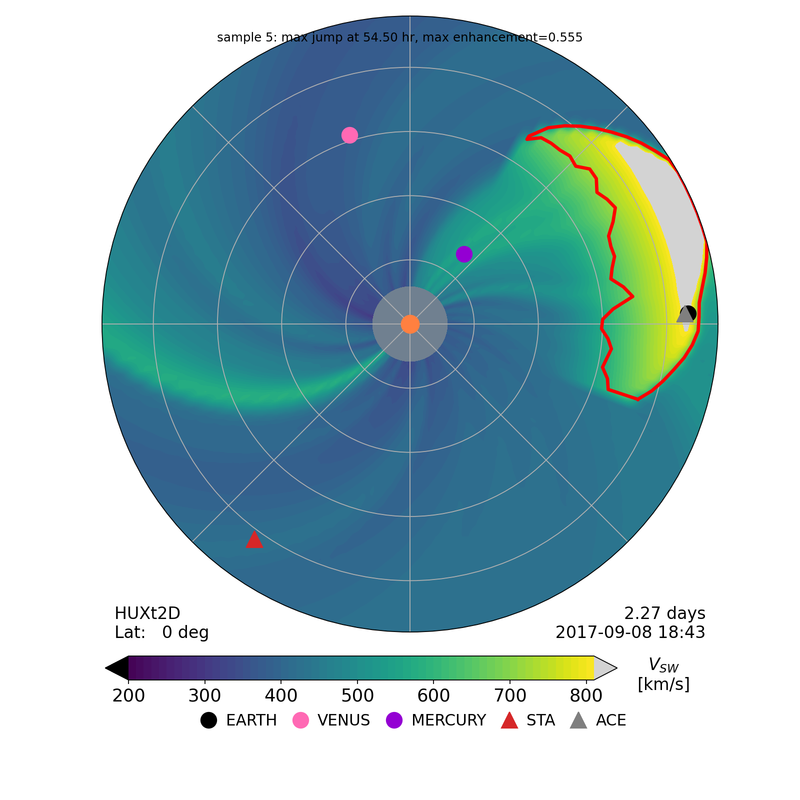

Conecast is a local, self-contained workflow for emulating coronal mass ejection (CME) arrival at Earth with HUXt and Gaussian-process surrogates.

[GitHub repository](https://github.com/georgemilosh/conecast) | [Tutorial](https://github.com/georgemilosh/conecast/blob/main/Tutorial.md) | [Notebook guide](https://github.com/georgemilosh/conecast/blob/main/notebooks/README.md)

## What it does

- prepares solar-wind boundary conditions from GONG magnetograms via WSA+
- runs HUXt-based CME simulations for curated events
- trains per-event GP surrogate models for hit or miss classification and arrival-time regression
- provides tutorial notebooks and Colab entry points

| Hit probability | Arrival time | HUXt heliosphere |
| :---: | :---: | :---: |
|  |  |  |

## Quick start

```bash
python scripts/fetch_wsaplus_checkpoint.py
python scripts/generate_huxt_input.py --event 2017-09-06
python scripts/gp_huxt_surrogate.py --event 2017-09-06 design --n 300
python scripts/gp_huxt_surrogate.py --event 2017-09-06 run --limit 20
python scripts/gp_huxt_surrogate.py --event 2017-09-06 fit
python scripts/gp_huxt_surrogate.py --event 2017-09-06 analyze
```

The repository does not ship large runtime data. WSA+ checkpoints, magnetograms, boundary files, and run outputs are downloaded or generated on demand.

## Tutorial notebooks

- [01 - GP tutorial](https://colab.research.google.com/github/georgemilosh/conecast/blob/main/notebooks/01_gp_tutorial.ipynb)
- [02 - HUXt inputs](https://colab.research.google.com/github/georgemilosh/conecast/blob/main/notebooks/02_huxt_runs.ipynb)
- [03 - Arrival detector examples](https://colab.research.google.com/github/georgemilosh/conecast/blob/main/notebooks/03_arrival_detector_examples.ipynb)
- [04 - GP surrogate application](https://colab.research.google.com/github/georgemilosh/conecast/blob/main/notebooks/04_gp_huxt_application.ipynb)

## Related links

- [Project repository](https://github.com/georgemilosh/conecast)
- [Main website projects page](https://georgemilosh.github.io/projects/)
